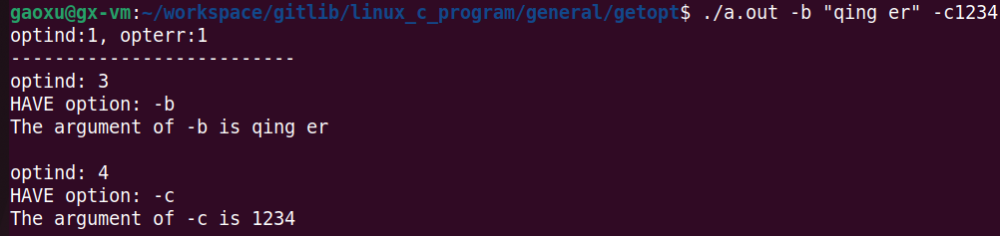
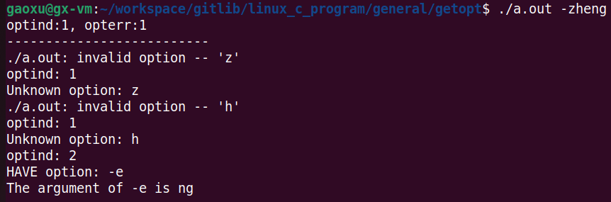

# Linux下getopt()函数的简单使用
> getopt() 函数是用来解析命令行选项参数的，但是只能解析短选项，如 -d 100，不能解析长选项，如 --prefix

使用getopt()函数时需要包含头文件 `unistd.h`。

getopt()函数原型如下：
```c
int getopt(int argc, char *argv[], const char *optstring);
```
**参数：**

argc, argv：这两个参数与main()函数的两个参数函数相同

optstring：此参数叫做`选项字符串`

**返回：**
如果选项成功找到，返回选项字母；如果所有命令行选项都解析完毕，则返回-1；如果遇到选项字符不在 optstring 中，返回字符'?'；如果遇到丢失参数，那么返回值依赖于 optstring 中第一个字符，如果第一个字符是''，则返回':'，否则返回'?'并提示出错误信息。


getopt()函数涉及到以下4个变量：
- char *optarg; 用于保存选项的参数
- int optind;   用于记录下一个检索位置
- int opterr;   表示是否将错误信息输出到stderr，为0时表示不输出
- int optopt;   表示不在选项字符串optstring中的选项


`解释下什么是选项？`

在linux下我们使用 gcc helloworld.c -o helloworld 指令，`在这条指令中 -o 就是命令行的选项`，而后面的 helloworld 就是 -o 选项所带的参数。 有些选项是不用带参数的，而这样不带参数的选项可以写在一起，例如删除一个目录 rm -rf，-r 和 -f 都可以不用参数，这里它们就可以写在一起。


`解释下什么是选项字符串？`

如`"a:b::cd:e"` 这就是一个选项字符串。对应到`命令行`就是 -a, -b, -c, -d, -e。`冒号表示参数，一个冒号就表示这个选项后面必须带有参数`(没有参数会报错)，但是这个参数可以和选项连写在一起，也可以用空格隔开，如 -a123 和 -a 123 都表示 123 是 -a 的参数；`两个冒号表示这个选项的参数是可选的`，但要注意带参数时，`参数与选项之间不能有空格`(有空格会报错)，这一点和一个冒号是有区别的。相当于给出规则。

下面以实际的代码解释(源码见文件 getopt_v1.c )：

```c
#include <unistd.h>
#include <stdio.h>
int main(int argc, char * argv[])
{
    int ch;
    printf("\n\n");
    printf("optind:%d，opterr：%d\n", optind, opterr);
    printf("--------------------------\n");
    while ((ch = getopt(argc, argv, "ab:c:de::")) != -1) {
        printf("optind: %d\n", optind);
        switch (ch) {
        case 'a':
            printf("HAVE option: -a\n\n");   
            break;
        case 'b':
            printf("HAVE option: -b\n"); 
            printf("The argument of -b is %s\n\n", optarg);
            break;
        case 'c':
            printf("HAVE option: -c\n");
            printf("The argument of -c is %s\n\n", optarg);
            break;
        case 'd':
            printf("HAVE option: -d\n");
                break;
        case 'e':
            printf("HAVE option: -e\n");
            printf("The argument of -e is %s\n\n", optarg);
            break;
        case '?':
            printf("Unknown option: %c\n",(char)optopt);
            break;
        }
    }
    return 0;
}
```
> 第一次输入测试：


可以看到，optint 和 opterr 的初始值都为1，而 opterr 为非零表示产生的错误信息都输出到标准错误输出(stderr)上。

那 optind 的初值为什么是1？

这就与 main() 函数的那两个参数有关了，argc 表示参数的个数，argv[] 表示每个参数字符串，对于上图中的输入，argc=3, argv[0]=./a.out, argv[1]=-b, argv[2]="qing er", 实际上真正的参数是从第二个 -b 开始的，所以 optint 的初始值为1。

当执行 getopt() 函数时，会依次扫描每一个命令行参数(从argv下标1开始)，第一个是 -b ，是一个选项，而且这个选项在选项字符串 optstring 中有匹配，我们看到 b 后面有冒号，也就是说 b 后面必须带有参数，而 "qing er" 就是 -b 的参数。所以这个命令行是符合要求的。至于执行后 optind 为什么是3，这是因为 optind 是下一次进行选项搜索的开始索引，也是说一次调用 getopt() 函数要从 argv[3] 开始搜索。当然，对于上图中的例子，argv[3] 为空，此时 getopt() 函数就会返回 -1。

> 第二次输入测试：



对于这个过程会调用3次 getopt() 函数，和第一次输入一样，是找到选项 -b 和它的参数 "qing er"，这时 optind 的值为3，也就意味着下一次的 getopt() 函数要从 argv[3] 开始搜索，所以第二次调用 getopt() 函数找到选项 -c 和它的参数 1234(选项和参数是连在一起的)，由于 -c1234写在一起，所以它两占用 argv[3]，所以下一次搜索从 argv[4] 开始(即 optind 少加一次)，而 argv[4] 为空，所以三次调用 getopt() 函数后返回 -1，循环结束。

接下来我们输入一个错误的命令。
> 第三次输入测试：



前面提到过不带参数的选项可以写在一起，所以 getopt() 找到 -z 的时候，发现在 optstring 中没有匹配，这时候它就认为 h 也是一个选项，也就是 -h 和 -z 写在一起了，依次类推，直到找到 -e，发现 optstring 中匹配。


最后说明一下，getopt() 函数会改变 argv[] 中参数的顺序。`经过多次调用 getopt() 后，argv[] 中的选项和选项的参数会被放置在数组最前面`，而 optind 会指向第一个非选项和参数的位置。看下面例子(源码见文件 getopt_v2.c )。
```c
#include <unistd.h>
#include <stdio.h>
int main(int argc, char * argv[])
{
    int i;
    printf("------------call getopt() before:--------------\n");
    for (i = 0; i < argc; i++) {
        printf("%s\n",argv[i]);
    }
    printf("-----------------------------------------------\n");

    int ch;
    printf("optind:%d，opterr：%d\n",optind, opterr);
    printf("--------------------------\n");
    while ((ch = getopt(argc, argv, "ab:c:de::")) != -1) {
        printf("optind: %d\n", optind);
        switch (ch) 
        {
        case 'a':
            printf("HAVE option: -a\n\n");   
            break;
        case 'b':
            printf("HAVE option: -b\n"); 
            printf("The argument of -b is %s\n\n", optarg);
            break;
        case 'c':
            printf("HAVE option: -c\n");
            printf("The argument of -c is %s\n\n", optarg);
            break;
        case 'd':
            printf("HAVE option: -d\n");
            break;
        case 'e':
            printf("HAVE option: -e\n");
            printf("The argument of -e is %s\n\n", optarg);
            break;
        case '?':
            printf("Unknown option: %c\n",(char)optopt);
            break;
        }
    }
    
    printf("----------------------------\n");
    printf("optind=%d, argv[%d]=%s\n", optind, optind, argv[optind]);

    printf("-----------call getopt() after:---------------\n");
    for(i = 0; i < argc; i++) {
        printf("%s\n",argv[i]);
    }
    printf("----------------------------------------------\n");

    return 0;
}

```

结果如下图：


可以看到 call getopt() before 和 call getopt() after 这两组打印的结果是不同的。被 getopt() 函数挑出的选项和对应的参数都按顺序放在了 argv 数据的前面，而那些既不是选项也不是参数的会按顺序放在后面。而此时 optind=4，即指向第一个非选项也非选项参数 zheng。

