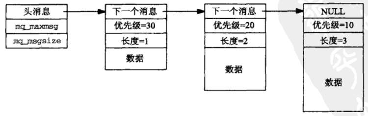
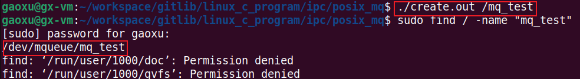

[TOC]
# 1. POSIX 消息队列概述
消息队列是 Linux IPC 中很常用的一种通信方式，它通常用来在不同进程间发送特定格式的消息数据。

消息队列与管道和 FIFO 有很大区别，主要有以下两点：

> ① 一个进程向消息队列写入消息前，并不需要某个进程在该队列上等待该消息的到达，而管道和 FIFO 是相反的，进程向其中写消息时，管道和 FIFO 必需已经打开来读，否则写进程就会阻塞(默认情况下)，那么内核会产生 SIGPIPE 信号。
> ② 管道和 FIFO 是随进程的持续性，当管道和 FIFO 最后一次关闭发生时，仍在管道和 FIFO 中的数据会被丢弃。消息队列是随内核的持续性，即一个进程向消息队列写入消息后，然后终止，另外一个进程可以在以后某个时刻打开该队列读取消息。只要内核没有重新自举或消息队列没有被删除。

消息队列中每条消息通常具有以下属性：

<font color=red size=4>一个表示优先级的整数， 消息的数据部分的长度， 消息数据本身</font>

POSIX 消息队列的一个可能的设计是一个如下图所示的消息链表，链表头部有消息队列的属性信息。



# 2. POSIX 消息队列创建与关闭
posix 消息队列的创建，关闭和删除涉及到以下三个函数：

```c
#include <mqueue.h>
// 成功返回消息队列描述符，失败返回-1
mqd_t mq_open(const char *name, int oflag, /* mode_t mode, struct mq_attr *attr*/);

//成功返回0，失败返回-1
int mq_close(mqd_t mqdes);

//成功返回0，失败返回-1
int mq_unlink(const char *name);
```

> `mqd_t mq_open(const char *name, int oflag, /* mode_t mode, struct mq_attr *attr */);`

**参数说明**

**name**：表示消息队列的名字，它符合 POSIX IPC 的名字规则。经过测试，在 ubuntu20.04 系统上，所创建的 POSIX 消息队列不会在文件系统中创建真正的路径名，且消息队列的名字只能以一个'/'开头，不能包含多个'/'，创建成功后的消息队列文件在 <font color=red>"/dev/mqueue/"</font> 路径下。(见下文中的测试程序)

**oflag**: 表示打开的标志，和 open 函数的类似。可取的值有 <font color=red>O_RDONLY, O_WRONLY, O_RDWR, O_CREAT, O_EXCL, O_NONBLOCK, O_TRUNC</font>。其中前三个参数必选其一，后四个参数为可选参数。

|标志|说明|
|:--|:--|
O_RDONLY|只读
O_WRONLY|只写
O_RDWR|可读写
O_CREAT|若对象不存在则创建对象；若对象已存在且未设置 O_EXCL 标志，则直接引用已存在的对象；若对象已存在且设置了 O_EXCL 标志，则直接返回 EEXIST 错误
O_EXCL|此参数与 O_CREAT 一起使用，O_CREAT\|O_EXCL；用来检查对象是否存在，若不存在则创建，或存在则返回 EEXIST 错误 (排它性创建)
O_NONBLOCK|非阻塞性访问对象
O_TRUNC|如果以读写模式打开了一个已存在的共享内存区对象，那么该标志将使得该对象的长度被截成0

<font color=red>当 oflag 取值中有 O_CREAT 时，下面两个参数才有效。</font>

**mode**: 该参数指定权限位，可取值如下：

|权限值|说明|
|:--|:--|
S_IRUSR|用户(属主)读
S_IWUSR|用户(属主)写
S_IRGRP|(属)组成员读
S_IWGRP|(属)组成员写
S_IROTH|其他用户读
S_IWOTH|其他用户写

这些权限值定义在 <sys/stat.h> 头文件中。所指定的权限位受当前进程的<font color=blue>文件模式创建掩码</font>修正，而该掩码可通过调用 umask() 或使用 shell 的 umask 命令来设置。

**attr**: 此参数用于给新队列指定某些属性，如果它为空指针，那就使用默认属性。具体在第3节解释。

> `int mq_close(mqd_t mqdes);`

mq_close() 用于关闭一个消息队列，和文件的 close 类似，关闭后，消息队列并不从系统中删除。一个进程结束，会自动调用关闭打开着的消息队列。

> int mq_unlink(const char *name);

参数 name 与 mq_open() 中参数的 name 一样。mq_unlink() 函数用于删除一个消息队列。消息队列创建后只有通过调用该函数或者是内核自举才能进行删除。每个消息队列都有一个保存当前打开描述符数的引用计数器，和文件一样，因此本函数能够实现类似于 unlink() 函数删除一个文件的机制。

下面是测试 mq_open() 函数的代码(源文件见 mqcreate1.c ):
```c
#include <fcntl.h>
#include <sys/stat.h>
#include <mqueue.h>
#include <unistd.h>
#include <stdio.h>
#include <stdlib.h>

#define FILE_MODE (S_IRUSR | S_IWUSR | S_IRGRP | S_IROTH)
int main(int argc, char *argv[])
{
    int ch, flags;
    mqd_t mqd;

    flags = O_RDWR | O_CREAT;
    while ( (ch = getopt(argc, argv, "e")) != -1) {
        switch (ch) {
            case 'e':
                flags |= O_EXCL;
                break;
            default:
                break;
        }
    }

    if (optind != argc - 1) {
        perror("usage: mqcreate [ -e ] <name>");
        exit(0);
    }

    if ( (mqd = mq_open(argv[1], flags, FILE_MODE, NULL)) < 0) {
        perror("mq_open error");
        exit(0);
    }

    mq_close(mqd);
    return 0;
}
```

测试结果如下：


可以看出，创建消息队列的文件名必须只有一个 '/'，且创建成功后消息队列文件在 "/dev/mqueue/" 路径下。

# 3. POSIX 消息队列的属性


# 4. POSIX 消息队列发送与接收

# 5. POSIX 消息队列的限制
