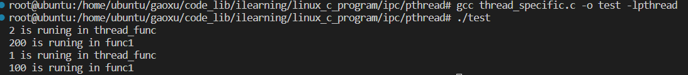

# 线程数据共享：pthread_getspecific及pthread_setspecific

pthread_getpecific 和 pthread_setspecific 提供了在同一线程中不同函数间共享数据，即线程存储的一种方法。具体涉及到下以三个函数。

## 1. pthread_key_create()
调用 pthread_key_create() 来创建一个类型为 pthread_key_t 类型的变量。

该函数原型如下：

```c
int pthread_key_create (pthread_key_t *__key, void (*__destr_function) (void *));
```

参数：

- __key：声明的 pthread_key_t 变量

- __destr_function：该参数是一个清理函数，用来在线程释放该线程存储的时候被调用。该函数指针可以设成 NULL，这样系统将调用默认的清理函数。


## 2. pthread_setspecific()
当线程中需要存储特殊值的时候调用该函数，该函数原型如下：

```c
int pthread_setspecific (pthread_key_t __key, const void *__pointer);
```

参数：

- __key：该参数为 pthread_key_create() 创建的 key

- __pointer：该参数为 void* 变量，用来存储任何类型的值

## 3. pthread_getspecific()

```c
void *pthread_getspecific (pthread_key_t __key);
```

该函数即为获取线程存储的数据。

## 4. pthread_key_delete()
```c
int pthread_key_delete (pthread_key_t __key);
```

当不在需要线程存储后调用该函数删除先前创建的 key。

## 4. 例子
源码见同级目录中的 thread_specific.c 文件。

```c
#include<stdio.h>
#include<pthread.h>
#include<string.h>
pthread_key_t p_key;
 
void func1()
{
        int *tmp = (int*)pthread_getspecific(p_key);//同一线程内的各个函数间共享数据。
        printf("%d is runing in %s\n",*tmp,__func__);
 
}
void *thread_func(void *args)
{
 
        pthread_setspecific(p_key,args);
 
        int *tmp = (int*)pthread_getspecific(p_key);//获得线程的私有空间
        printf("%d is runing in %s\n",*tmp,__func__);
 
        *tmp = (*tmp)*100;//修改私有变量的值
 
        func1();
 
        return (void*)0;
}
int main()
{
        pthread_t pa, pb;
        int a=1;
        int b=2;
        pthread_key_create(&p_key,NULL);
        pthread_create(&pa, NULL,thread_func,&a);
        pthread_create(&pb, NULL,thread_func,&b);
        pthread_join(pa, NULL);
        pthread_join(pb, NULL);
        return 0;
}
```

编译：

```c
gcc thread_specific.c -o test lpthread
./test
```

运行结果：



