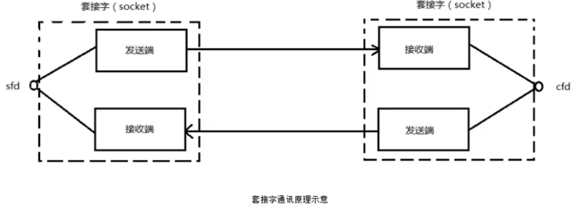
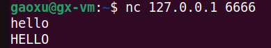

[TOC]
# 1. 套接字概念
Socket 本身有"插座"的意思，在 Linux 环境下，用于表示进程间网络通信的特殊文件类型。本质为内核借助缓冲区形成的伪文件。

既然是文件，那么理所当然的，我们可以使用文件描述符引用套接字。与管道类似的，Linux 系统将其封装成文件的目的是为了统一接口，使得读写套接字和读写文件的操作一致。区别是管道主要用于本地进程间通信，而套接字多应用于网络进程间通信的传递。

套接字的内核实现较为复杂，不宜在学习初期深入学习。

在 TCP/IP 协议中，"IP 地址 + TCP 或 UDP 端口号"唯一标识网络通信中的一个进程。"IP 地址 + 端口号"就对应一个 socket。欲建立连接的两个进程各自有一个 socket 来标识，那么这两个 socket 组成的 socket pair 就唯一标识一个连接。因此可以用 socket 来描述网络连接的一对一关系。

套接字通信原理如下图所示：



在网终通信中，套接字一定是成对出现的。一端的发送缓冲区对应对端的接收缓冲区。我们使用同一个文件描述符所发送缓冲区和接收缓冲区。

TCP/IP 协议最早在 BSD UNIX 上实现，为 TCP/IP 协议设计的应用层编程接口称为 socket API。本章的主要内容是 socket API，主要介绍 TCP 协议的函数接口，最后介绍 UDP 协议和 UNIX Domain Socket 的函数接口。

# 2. 预备知识
## 2.1 网络字节序
我们已经知道，内存中的多字节数据相对于内存地址有大端和小端之分，磁盘文件中的多字节数据相对于文件中的偏移地址也有大端和小端之分。网络数据流同样有大端小端之分，那么如何定义网络数据流的地址呢？发送主机通常将发送缓冲区中的数据按内存地址从低到高的顺序发出，接收主机把从网络上接收到的字节依次保存在接收缓冲区中，也是按内存地址从低到高的顺序保存，因此，网络数据流的地址应这样规定：先发出的数据是低地址，后发出的数据是高地址。

TCP/IP 协议规定，`网络数据流应采用大端字节序`，即低地址高字节。例如上一节的 UDP 段格式，地址0-1是16位的源端口号，如果这个端口号是1000(0x3e8)，则地址0是0x03，地址1是0xe8，也就是先发0x03，再发0xe8，这16位在发送主机的缓冲区也应该是低地址存0x03，高地址存0xe8。但是，如果发送主机是小端字节序的，这16位被解释成0xe803，而不是1000。因此，发送主机把1000填到发送缓冲区之前需要做字节序的转换。同样地，接收主机如果是小端字节序的，接收到的16位的源端口号也要做字节序的转换。如果主机是大端字节序的，发送和接收都不需要做转换。同理，32位的 IP 地址也要考虑网络字节序和主机字节序的问题。

为使网络程序具有可移植性，使同样的C代码在大端和小端计算机上编译后都能正常运行，可以调用以下库函数做`网络字节序和主机字节序的转换`。

```c
#include <arpa/inet.h>
uint32_t htonl(uint32_t hostlong);
uint16_t htons(uint16_t hostshort);
uint32_t ntohl(uint32_t netlong);
uint16_t ntohs(uint16_t netshort); 
```

h 表示 host，n 表示 network， l 表示 32 位长整数，s 表示 16 位短整数。

如果主机是小端字节序，这些函数将参数做相应的大小端转换然后返回，如果主机是大端字节序，这些函数不做转换，将参数原封不动地返回。

## 2.2 IP地址转换函数
早期(废弃):

```c
#include <sys/socket.h>
#include <netinet/in.h>
#include <arpa/inet.h>
int inet_aton(const char *cp, struct in_addr *inp);
in_addr_t inet_addr(const char *cp);
char *inet_ntoa(struct in_addr in);
```

只能处理 IPV4 的 ip 地址；不可重入函数；注意参数是 struct in_addr。

现在：

```c
#include <arpa/inet.h>
int inet_pton(int af, const char *src, void *dst);
const char *inet_ntop(int af, const void *src, char *dst, socklen_t size);
```

支持 IPV4 和 IPV6；可重入函数；其中 inet_pton 和 inet_ntop 不仅可以转换 IPV4 的 in_addr，还可以转换 IPV6 的 in6_addr。

例如，把点分十进制的 IP 地址转换为网络字节序，使用 inet_pton()；相反的使用 inet_ntop();

参数：

**af**: 取值为 AF_INET(转换IPV4) 或 AF_INET6(转换IPV6)

**src**: 要转换的源数据，即点分十进制的IP地址或网络字节序

**dst**：转换后的结果

**size**：转换后的 dst 字符串的大小

## 2.3 sockaddr数据结构
`struct sockaddr` 很多网络编程函数诞生早于 IPV4 协议，那时候都使用的是 sockaddr 结构体，为了向前兼容，现在 sockaddr 退化成了(void *)的作用，传递一个地址给函数，至于这个函数是 sockaddr_in 还是 sockaddr_in6，由地址族确定，然后函数内部再强制类型转化为所需的地址类型。


```c
struct sockaddr {
    sa_family_t sa_family;  /* address family, AF_xxx */
    char sa_data[14];       /* 14 bytes of protocol address */
}
```

使用 `sudo grep -r "struct sockaddr_in {" /usr` 命令可查看到 struct sockaddr_in 结构体的定义，或 `man 7 ip`，一般其默认的存储位置： `/usr/include/linux/in.h` 文件中。

```c
struct sockaddr_in {
    sa_family_t sin_family;     //address family: AF_INET
    in_port_t sin_port;     //port in network byte order
    struct in_addr sin_addr;       //internet address
};

/* Internet address */
struct in_addr {
    uint32_t s_addr;        //address in network byte order
};
```

下面是 IPV6 的相关结构体定义，如下：

```c
struct sockaddr_in6 {
    unsigned short int sin6_family; //AF_INET6
    __be16 sin6_port;   //Transport layer port #
    __be32 sin6_flowinfo;   //IPV6 flow information
    struct in6_addr sin6_addr;  //IPV6 address
    __u32 sin6_scope_id;    //scope id (new in RFC2553)
};

struct in6_addr {
    union {
        __u8 u6_addr8[16];
        __be16 u6_addr16[8];
        __be32 u6_addr32[4];
    } in6_u;
#define s6_addr in6_u.u6_addr8
#define s6_addr16 in6_u.u6_addr16
#define s6_addr32 in6_u.u6_addr32
};

#define UNIX_PATH_MAX 108
struct sockaddr_un {
    __kernel_sa_family_t sun_family;    //AF_UNIX
    char sum_path[UNIX_PATH_MAX];   //pathname
}
```

IPV4 和 IPV6 的地址格式定义在 <font color=red>netinet/in.h</font> 中，IPV4 地址用 <font color=red>sockaddr_in</font> 结构体表示，包括 16 位端口号和 32 位 IP 地址，IPV6 地址用 <font color=red>sockaddr_in6</font> 结构体表示，包括 16 位端口号、128 位 IP 地址和一些控制字段。UNIX Domain Socket 的地址格式定义在<font color=red>sys/un.h</font> 中，用 <font color=red>sockaddr_un</font> 结构体表示。各种 socket 地址结构体的开头都是相同的，前 16 位表示各个结构体的长度(并不是所有 UNIX 的实现都有长度字段，如 Linux 就没有)。后 16 位表示地址类型。IPV4、IPV6 和 UNIX Domain Socket 的地址类型分别定义为常数 <font color=blue>AF_INET、 AF_INET6、AF_UNIX</font>。 这样，只要取得某种 sockaddr 结构体的首地址，不需要知道具体是哪种类型的 sockaddr 结构体，就可以根据地址类型字段确定结构体中的内容。因此，socket API 可以接受各种类型的 sockaddr 结构体做参数，例如 bind、accept、connect 等函数，这些函数的参数应该设计成 void * 类型以便接受各种类型的指针，但是 socket API 的实现早于 ANSI C 标准化，那时还没有 void * 类型，因此这些函数的参数都用 struct sockaddr * 类型表示，在传递参数之前要强制类型转换一下，例如;

```c
struct sockaddr_in servaddr;
bind(fd, (struct sockaddr *)&servaddr, sizeof(servaddr));
```

# 3. 网络套接字函数
## 3.1 socket模型创建流程图


## 3.2 socket 函数
```c
#include <sys/types.h>
#include <sys/socket.h>
int socket(int domain, int type, int ptotocol);
```

参数：

**domian:** 有以下三种取值：
AF_INET 这是大多数用来产生 socket 的协议，使用 TCP 或 UDP 来传输，用 IPV4 的地址

AF_INET6 与上面的类似，不过是用来 IPV6 的地址

AF_UNIX 本地协议，使用在 UNIX 和 Linux 系统上，一般都是当客户端和服务器在同一台及其上的时候使用。

**type:** 有以下几种取值:

SOCK_STREAM 这个协议是按照顺序的、可靠的、数据完整的基于字节流的连接。这是一个使用最多的 socket 类型，这个 socket 是使用 TCP 来进行传输；

SOCK_DGRAM 这个协议是无连接的、固定长度的传输调用。该协议是不可靠的，使用 UDP 来进行它的连接；

SOCK_SEQPACKET 该协议是双线路的、可靠的连接，发送固定长度的数据包进行传输。必须把这个包完整的接收才能进行读取；

SOCK_RAW socket 类型提供单一的网络访问，这个 socket 类型使用 ICMP 公共协议。(ping、traceroute 使用该协议)；

SOCK_RDM 这个类型是很少使用的，在大部分的操作系统上没有实现，它是提供给数据链路层使用，不保证数据包的顺序。

**protocol:** 传 0 使用默认协议。

**返回值：** 成功返回指向新创建的 socket 的文件描述符，失败返回 -1，同时设置 errno。

socket() 打开一个网络通信端口，如果成功的话，就像 open() 一样返回一个文件描述符，应用程序可以像读写文件一样用 read/write 在网络上收发数据，如果 socket() 调用出错则返回 -1。对于 IPV4，domain 参数指定为 AF_INET。对于 TCP 协议，type 参数指定为 SOCK_STREAM，表示面向流的传输协议。如果是 UDP 协议，则 type 参数指定为 SOCK_DGRAM，表示面向数据报的传输协议。protocol 参数的介绍从略，指定为 0 即可。

## 3.3 bind 函数
```c
#include <sys/types.h>
#include <sys/socket.h>
int bind(int sockfd, const struct sockaddr *addr, socklen_t addrlen);
```

参数：

**sockfd:** socket 文件描述符

**addr:** 构造出的 IP 地址和端口号

**addrlen:** sizeof(addr) 的长度

**返回值：** 成功返回0，失败返回-1，并设置 errno

服务器程序所监听的网络地址和端口号通常是固定不变的，客户端程序得知服务器程序的地址和端口号后就可以向服务器发起连接，因此服务器需要调用 bind 绑定一个固定的网络地址和端口号。

bind() 的作用是将参数 sockfd 和 addr 绑定在一起，使 sockfd 这个用于网络通信的文件描述符监听 addr 所描述的地址和端口号。前面讲过，struct sockaddr * 是一个通用指针类型，addr 参数实际上可以接受多种协议的 sockaddr 结构体，而它们的长度各不相同，所以需要第三个参数 addrlen 指定结构体的长度。

## 3.4 listen 函数
```c
#include <sys/types.h>
#include <sys/socket.h>
int listen(int sockfd, int backlog);
```

参数：

**sockfd:** socket 文件描述符

**backlog:** 排队建立3次握手队列和刚刚建立3次握手队列的链接数之和

**返回值：** 成功返回0，失败返回-1

查看系统默认的 backlog，使用命令 <font color=red>cat /proc/sys/net/ipv4/tcp_max_syn_backlog</font>

典型的服务器程序可以同时服务于多个客户端，当有客户端发起连接时，服务器调用的 accept() 返回并接受这个连接，如果有大量的客户端发起连接而服务器来不及处理，尚未 accept 的客户端就处于连接等待状态，listen() 声明 sockfd 处于监听状态，并且最多允许有 backlog 个客户端处于连接等待状态，如果接收到更多的连接请求就忽略。

## 3.5 accept 函数
```c
#include <sys/types.h>
#include <sys/socket.h>
int accept(int sockfd, struct sockaddr *addr, socklen_t *addrlen);
```

参数：

**sockfd:** socket 文件描述符

**addr:** 传出参数，返回连接客户端地址信息，含 IP 地址和端口号

**addrlen:** 传入传出参数(值-结果)，传入 sizeof(addr) 大小，函数返回时返回真正接收到地址结构体的大小

**返回值：** 成功返回一个新的 socket 文件描述符，用于和客户端通信，失败返回-1，并设置 errno。

三次握手完成后，服务器调用 accept() 接受连接，如果服务器调用 accept() 时还没有客户端的连接请求，就阻塞等待直到有客户端连接上来。addr 是一个传出参数，accept() 返回时传出客户端的地址和端口号。addrlen 参数是一个传入传出参数，传入的是调用者提供的缓冲区 addr 的长度以避免缓冲区溢出问题，传出的是客户端地址结构体的实际长度(有可能没有占满调用者提供的缓冲区)。如果给 addr 参数传 NULL，表示不关心客户端的地址。

## 3.6 connect 函数
```c
#include <sys/types.h>
#include <sys/socket.h>
int connect(int sockfd, const struct sockaddr *addr, socklen_t addrlen);
```

参数：

**sockfd:** socket 文件描述符

**addr:** 传入参数，指定服务器端地址信息，含 IP 地址和端口号

**addrlen:** 传入参数，传入 sizeof(addr) 大小

**返回值：** 成功返回0，失败返回-1，并设置errno

客户端需要调用 connect() 连接服务器，connect 和 bind 的参数形式一致，区别在于 bind 的参数是自己的地址，而 connect 的参数是对方的地址。

# 4. C/S模型-TCP
再来回顾一下 socket 模型创建流程图，如下：


这里实现一个小功能，客户端发送给服务器一串小写字母，服务端收到后将其转换成大写字母并回传给客户端，客户端将其结果打印出来。

其程序运行结果如下图：

服务端程序写好之后可以直接使用 `nc` 命令测试，运行服务端程序，然后重新开个终端，输入 nc 命令即可测试，如下：



使用客户端配合测试结果如下：


服务器端程序见 ./TCP/server.c ; 客户端程序见 ./TCP/client.c

# 5. 出错处理封装函数
## 5.1 wrap.c

## 5.2 wrap.h

