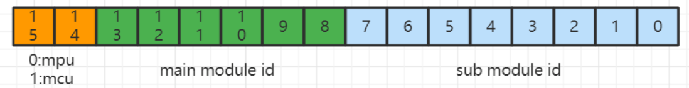
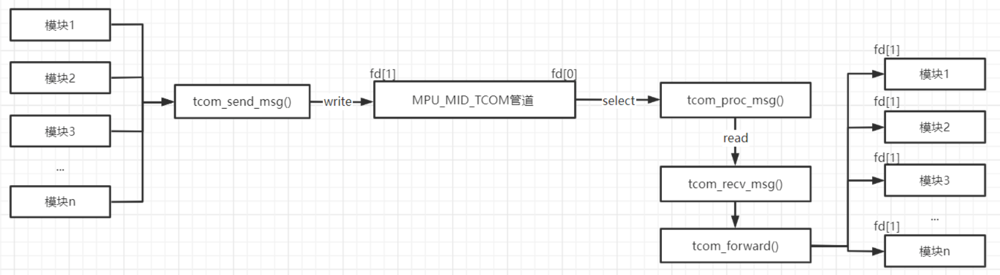

# 基于pipe及select的线程间通信
## 1. 概述

tbox各模块间的通信方式基本上都是基于tcom框架；tcom是利用Linux的无名管道设计的，不同之处在于这里的tcom创建的管道都是用于线程之间的通信，而非父子进程间的通信。

其主要实现思路为：首先确定好要使用tcom通信机制的模块的数量，然后创建该数量的管道，使用结构体数组把这些管道组织起来，再为每一个管道创建一个队列，这些队列同样用结构体数组组织起来(这些队列才是真正保存模块间互发的数据)； 模块与模块之间并不是直接相互通信的，而是每个模块想要与其它模块通信时，都需要先把数据发送给 MPU_MID_TCOM模块，而MPU_MID_TCOM模块收到各个模块的数据后负责转发，这样做的好处在于减少重复代码，提高代码的利用率。

## 2. 数组组织
### 2.1 相关宏定义
首先确定都有哪些模块需要使用tcom进行通信，使用枚举值列出来，如下：

```c
#define MPU_MID_TIMER         0x0100   /* os timer main module */
#define MPU_MID_CFG           0x0200   /* configuration management main module */
#define MPU_MID_DEV           0x0300   /* OTA upgrade management main module */
#define MPU_MID_AT            0x0400   /* AT process main module */
#define MPU_MID_NM            0x0500   /* data forward main module */
#define MPU_MID_SHELL         0x0600   /* debug management main module */
#define MPU_MID_TCOM          0x0700   /* thread com management main module */
#define MPU_MID_PM            0x0800   /* power management module */
#define MPU_MID_GPS           0x0900   /* GPS management module */
#define MPU_MID_CAN           0x0A00   /* GPS management module */
#define MPU_MID_SCOM          0x0B00   /* spi com management module */
#define MPU_MID_UDS           0x0C00   /* UDS app stack module */
#define MPU_MID_ASSIST        0x0D00   /* tbox assist management module */
#define MPU_MID_GB32960       0x0E00   /* GB32960 protocal module */
#define MPU_MID_OTA           0x0F00   /* intest OTA protocal module */
#define MPU_MID_DSU           0x1000   /* data Storage unit module*/
#define MPU_MID_NTP           0x1100   /* NTP module add by zhangyf */
#define MPU_MID_UCOM          0x1200   /* spi com management module */
#define MPU_MID_NGCP          0x1300   /* intest NGCP protocal module */
#define MPU_MID_LCCTRL        0x1400   /* local control module */
#define MPU_MID_REMOTE_DIAG   0x1500   /* REMOTE_DIAG */
#define MPU_MID_EXTERN_MODULE 0x1600   /* external module ipc thread */
```

各模块的枚举值的取值是有规则的，其规则如下图：



接下来根据枚举值的定义规则定义以下几个宏方便后面程序中做入参的合法性判断：

```c
#define MAIN_MID_MASK              0x3f00   /* bit13 to bit 8 is main module id */
#define CPUID_MASK                 0xc000   /* bit15 and bit14 is cpuid */
#define SUB_MID_MASK               0x00ff   /* bit7 to bit0 is sub module id */
#define CPUID_MAIN_MID_MASK        0xff00   /* bit15 to bit 0 is main module id and cpuid */

#define MPU_ID                     (0)      /*cpuid for MPU*/
#define MCU_ID                     (1)      /*cpuid for MCU*/

#define MID_TO_INDEX(MID)      (((MID & MAIN_MID_MASK) >> 8) - 1)
#define INDEX_TO_MID(INDEX)    (((INDEX+1) << 8) & MAIN_MID_MASK)

#define MPU_MIN_MID           MPU_MID_TIMER
#define MPU_MAX_MID           MPU_MID_EXTERN_MODULE   /* when add new MID type remember to change this */

#define MPU_APP_MID_COUNT     (((MPU_MAX_MID - MPU_MIN_MID) >> 8) + 1)    //获取模块的总个数，以便确定创建多少个管道
```

### 2.2 管道数据组织
tcom中的管道是以结构体数组的形式组织，如下：

```c
typedef struct TCOM_PIPE
{
    int fd[2];  /* fd[0] is used for reading and fd[1] is used for writing */
} TCOM_PIPE;

static TCOM_PIPE  tcom_pipe[MPU_APP_MID_COUNT];
```

### 2.3 队列数据组织
队列数据的组织形式也是以结构体数组，如下：

```c
typedef struct TCOM_QUEUE
{
    int head;
    int tail;
    unsigned char buf[TCOM_QUEUE_BUF_SIZE];
} TCOM_QUEUE;

static TCOM_QUEUE tcom_queue[MPU_APP_MID_COUNT];
```

### 2.4 传递的消息体头
模块之间在管道中传递的数据被定义成一个结构体，其包含发送方的id，接收方的id，消息id及指示在队列中传递数据的长度。其结构体定义如下：

```c
typedef struct TCOM_MSG_HEADER
{
    unsigned short sender;    /* the mid of sender */
    unsigned short receiver;  /* the mid of receiver */
    unsigned int   msgid;     /* message id */
    unsigned int   msglen;    /* message body length */
} TCOM_MSG_HEADER;
```

这里解释下为什么在管道中传递的消息结构体中定义的有sender和receiver，那是因为所有模块发送消息时都会把消息发给MPU_MID_TCOM，然后由 MPU_MID_TCOM统一进行转发，但MPU_MID_TCOM怎么知道它要转发给哪个模块勒？那是因为MPU_MID_TCOM会用到TCOM_MSG_HEADER结构体中的 receiver 这个值，然后把消息转发给 receiver 这个模块。

## 3. tcom的初始化
tcom的初始化即根据宏 MPU_APP_MID_COUNT 的值创建对应数量的管道，核心代码如下：

```c
int tcom_init(void)
{
    int i, ret;
    for (i = 0; i < MPU_APP_MID_COUNT; i++) {
        ret = pipe(tcom_pipe[i].fd);
        //省略出错判断
        int flag;
        flag = fcntl(tcom_pipe[i].fd[TCOM_PIPE_WRITE], F_GETFL);
        ret  = fcntl(tcom_pipe[i].fd[TCOM_PIPE_WRITE], F_SETFL, flag | O_NONBLOCK);
        //省略出错判断
        tcom_init_queue(i);
    }
}
tcom_init_queue() 函数的初始化很简单，只用把队列的头和尾置为0即可，如下：
static void tcom_init_queue(int queueidx)
{
    /* init msg queue */
    tcom_queue[queueidx].head = 0;
    tcom_queue[queueidx].tail = 0;
}
```

## 4. tcom的运行
前面说过，各个模块的消息互发都是通过MPU_MID_TCOM模块进行转发的，即各个模块都会给MPU_MID_TCOM发送消息，所以tcom通信机制能够稳定运行的关键就在于保证MPU_MID_TCOM的稳定运行。
如下是MPU_MID_TCOM运行的核心代码：

```c
void *tcom_main(void)
{
    int index;
    int maxfd = 0;
    int ret;
    fd_set fds;

    prctl(PR_SET_NAME, "TCOM");
    index = MID_TO_INDEX(MPU_MID_TCOM); //利用宏获得MPU_MID_TCOM在tcom_pipe结构体数组中的下标
    FD_ZERO(&fds);
    FD_SET(tcom_pipe[index].fd[TCOM_PIPE_READ], &fds); //监听MPU_MID_TCOM的读端口，即fd[0]
    maxfd = tcom_pipe[index].fd[TCOM_PIPE_READ];

    while (1)
    {
        /* monitor the incoming data */
        ret = select(maxfd + 1, &fds, NULL, NULL, NULL);
        /* the file deccriptor is readable */
        if (ret > 0 && FD_ISSET(tcom_pipe[index].fd[TCOM_PIPE_READ], &fds))
        {
            tcom_proc_msg();
            continue;
        }
        //省略出错判断
    }

    return NULL;
}
```

## 5. tcom数据的转发
从第4小节可以看出，MPU_MID_TCOM使用select系统调用，阻塞监听 MPU_MID_TCOM 管道的读端(fd[0])，一旦其它模块把数据写入到 MPU_MID_TCOM 的写端(fd[1])，这里select就会返回为真，MPU_MID_TCOM就会调用 tcom_proc_msg() 函数。此函数的主要功能如下：

```c
static int tcom_proc_msg(void)
{
    int ret = 0;
    TCOM_MSG_HEADER msghdr;

    /* 从MPU_MID_TCOM的读端获取数据，msghdr为从读端获取到的消息体头，tcom_msgbuf即从队列中读出的数据 */
    ret = tcom_recv_msg(MPU_MID_TCOM, &msghdr, tcom_msgbuf);
    //省略出错判断
    if (MPU_MID_TCOM != (msghdr.receiver & CPUID_MAIN_MID_MASK)) //所有模块都是发送给MPU_MID_TCOM,由MPU_MID_TCOM统一转发,否则就出错
    {
        //这里MPU_MID_TCOM会根据msghdr.receiver这个值把消息转发给msghdr.receiver这个模块，转发的实际数据就是tcom_msgbuf
        ret = tcom_forward(&msghdr, msghdr.receiver, tcom_msgbuf);
        //省略出错判断
    }
    //省略出错判断
    return 0;
}
```

tcom_recv_msg() 函数的主要功能：

1. 从 MPU_MID_TCOM 的读端读取数据，实际上就是调用 read() 系统调用； 
2. 把读取到的数据保存到对应的队列中。


其核心代码如下：

```c
int tcom_recv_msg(unsigned short main_mid, TCOM_MSG_HEADER *msghdr, unsigned char *msgbody)
{
    int ret = 0;
    int index;
    unsigned char *buf;

    index = MID_TO_INDEX(main_mid);
    buf = (unsigned char *)msghdr;
    //dev_read实际上就是对read()系统调用的简单封装，循环读取数据，直到数据读完
    ret = dev_read(tcom_pipe[index].fd[TCOM_PIPE_READ], buf, sizeof(TCOM_MSG_HEADER));
    //省略各种出错检查
    //从对应的队列中取出数据存放到msgbody缓存区中；这里注意队列的操作是循环队列方式，另外注意当数据量跨过缓存区的结尾时的处理
    ret = tcom_dequeue_msg(index, msghdr, msgbody);
    //省略各种出错检查
    return 0;
}
```

tcom_forward() 函数的主要功能：

1. 把接收到的实际的数据加到队列中;
2. 通知指定模块来读取数据(把消息头写到指定模块的写端fd[1])，完成消息的转发。


其核心代码如下：

```c
static int tcom_forward(const TCOM_MSG_HEADER *msghdr, unsigned short receiver, const unsigned char *msgbody)
{
    int index;
    int ret;
    unsigned char *buf;

    index = MID_TO_INDEX(receiver);
    //省略一些合法性判断
    //把实际的数据push到队列中，注意这里的index为实际要接收的模块receiver
    ret = tcom_enqueue_msg(index, msghdr, msgbody);

    //这里就是通知真正的模块数据已就绪，即写消息头到指定模块的写端，然后指定的模块的读端就会监听到，进而去读
    buf = (unsigned char *)msghdr;
    ret = dev_write(tcom_pipe[index].fd[TCOM_PIPE_WRITE], buf, sizeof(TCOM_MSG_HEADER));
    //省略一些必要的错误检查

    return ret;
}
```

## 6. tcom数据接收
tcom数据接收其实是由其它模块调用 tcom_send_msg() 函数完成的。我们知道其它所有模块发送消息时都必须先发给MPU_MID_TCOM的，所以我们可以看到 tcom_send_msg() 函数中就发送的模块ID固定就是MPU_MID_TCOM。其核心代码如下：

```c
int tcom_send_msg(const TCOM_MSG_HEADER *msghdr, const void *msgbody)
{
    int ret;
    //各种入参合法性检查，这里省略

    /* 这里直接又是调用tcom_forward函数，但第二个参数固定写为MPU_MID_TCOM了 */
    ret = tcom_forward(msghdr, MPU_MID_TCOM, msgbody);
    //出错检查

    return 0;
}
```

这里举个例子，看一下其它模块都是怎么给tcom发数据的。其它模块的一般调用形式如下：

```c
    msghdr.sender   = MPU_MID_TIMER;
    msghdr.receiver = MPU_MID_PM;
    msghdr.msgid    = PM_MSG_OFF;
    msghdr.msglen   = 0;
    //这里只发送了个消息头，实际的消息体是空
    tcom_send_msg(&msghdr, NULL);
```

上面这个例子的调用流程如下：首先其它模块调用 tcom_send_msg() 函数把消息头写到 MPU_MID_TCOM 的写端(如果消息体不为空的话同时把消息体写入到队列中)，MPU_MID_TCOM 从读端读取消息头(如果消息体不为空的话同时也会从队列中读出消息体)；然后根据消息头中的 receiver 把消息再转发给对应的模块，具体流程如下图：

