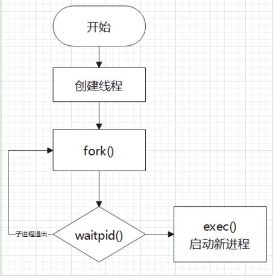
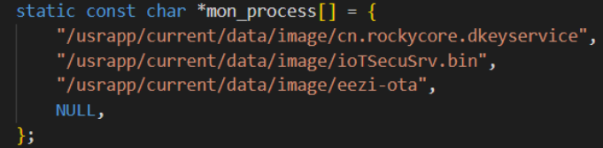
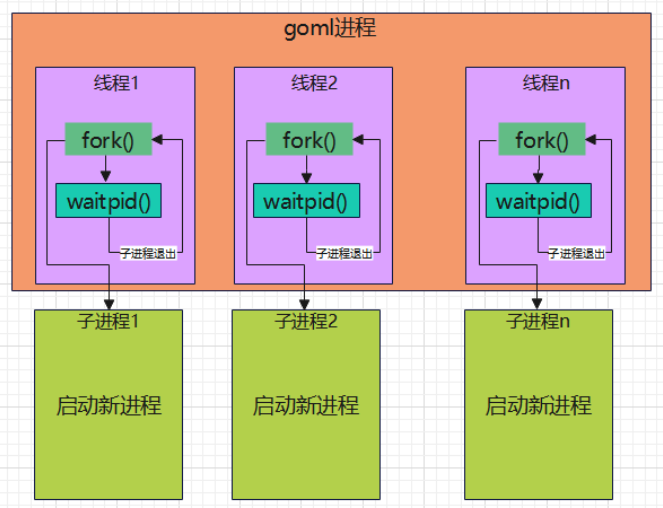

# 1.当前问题
项目中的goml监控程序只能监控一个应用，即cn.rockycore.dkeyservice；现在的需求是需要让goml监控程序可以监控多个应用，并且可监控的应用的数量可以配置。

# 2.需求
修改goml监控程序，使其可以同时监控多个应用，目前需要监控的应用有cn.rockycore.dkeyservice，ioTSecuSrv.bin，eezi-ota三个。
goml的职责就是监控这三个应用，当这三个应用中的任意一个应用意外停止运行后，goml监控程序负责把其再拉起运行。

# 3.设计方案
整体方案流程如下：

goml会根据程序中配置的待监控应用的个数创建对应数量个线程，在每个线程中fork创建一个子进程，然后用待监控的应用替换子进程，而线程中一直循环监控子进程的状态，如果发现子进程退出，则接着再调用fork创建其子进程，使其应用再重新运行起来。
目前goml程序中使用硬编码的方式来配置待监控的应用，如下图：

goml程序运行起来后的内存布局如下图：

# 4.优化
因为goml程序中配置可监控的应用是采用硬编码方式，所以当需要添加新的应用需要监控时需要修改源代码，重新编译程序，替换.bin文件，整个过程比较麻烦。可优化的方式为把需要监控的应用写在一个配置文件中，goml启动时读取此配置文件，然后依次启动配置文件中配置的应用。好处在于之后想添加或删除需要监控的应用时只需要修改配置文件即可，无须修改编译代码。

# 5.源码示例
见文件 goml.c