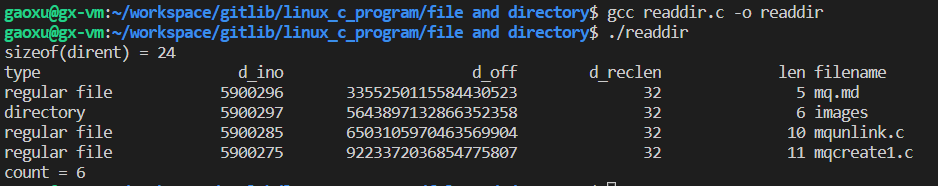

# readdir如何遍历目录子文件？
## 1. opendir 打开目录
opendir 有2个版本：`opendir, fdopendir`。前者参数为目录对应字符串，后者参数为目录对应已打开的文件描述符。

```c
#include <sys/types.h>
#include <dirent.h>

/* 成功返回指针，失败返回NULL */
DIR *opendir(const char *name);
DIR *fdopendir(int fd);
```

用法模型：

```c
DIR *dirp;
const char *base_dir = "/home/test/";

if ((dirp = opendir(base_dir)) == NULL) {
    perror("opendir error!");
    return -1;
}

//调用readdir遍历目录子文件
...
closedir(base_dir);
```

## 2. readdir 遍历目录子文件
readdir 需要一个已打开(调用 opendir) 的 DIR 对象作为参数。其函数原型如下：

```c
#include <dirent.h>

struct dirent *readdir(DIR *dirp);
int readdir_r(DIR *dirp, struct dirent *entry, struct dirent **result); //该函数已弃用
```

其中 dirent 结构如下：

```c
struct dirent {
    ino_t d_ino;
    off_t d_off;
    unsigned short d_reclen;
    unsigned char d_type;
    char d_name[256];
}
```

**d_ino**:此目录进入点的Inode

**d_off**:目录文件开头到此目录进入点的位移

**d_reclen**:d_name的长度，不包含NULL

**d_type**:该成员指明文件的类型，其取值如下：

|type|说明|
|:--|:--
DT_BLK|块设备
DT_CHR|字符设备
DT_DIR|目录
DT_FIFO|有名管道
DT_LNK|符号链接
DT_REG|普通文件，即ls -al显示出来的属性中，第一个属性为[-]，例如[-rwxrwxrwx]
DT_SOCK|UNIX domain socket
DT_UNKNOWN|未知

**d_name**:以NULL为结束符的文件名

遍历子文件模型：

```c
DIR *dirp;
const char *base_dir = "/home/test/";

if ((dirp = opendir(base_dir)) == NULL) {
    perror("opendir error");
    return -1;
}

struct dirent *dp;
while ((dp = readdir(dirp)) != NULL) {
    ...
}

closedir(base_dir);
```

这里有一个示例，列出指定目录下的所有文件，源码见 readdir.c。其运行结果如下：

当前目录中的文件列表如下：


测试程序执行结果如下：

